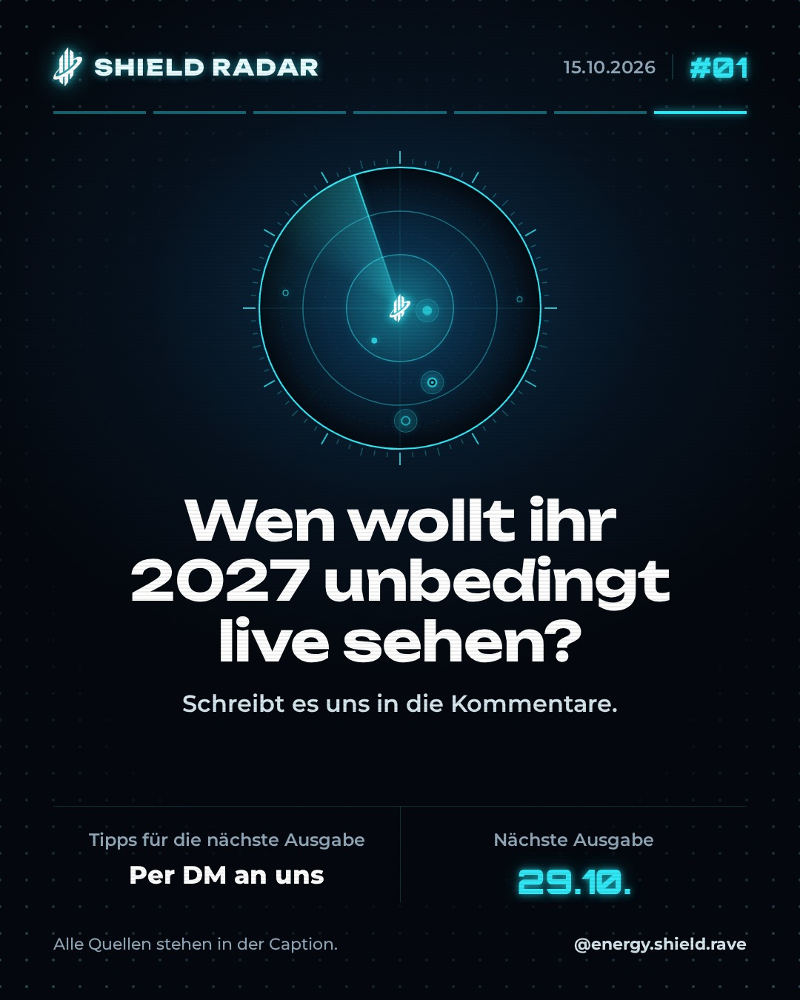

# Vorschau: geplante Posts

Stand: 05.10.2026 12:13. Jeder Post geht frühestens **24 Stunden nach seiner Erstellung** online.

Posts werden 4 Tage vor ihrem Termin an Buffer übergeben und verschwinden dann von hier.

**Einspruch:** Solange ein Post hier steht: auf `post.json` tippen → Stift-Symbol → `"status": "geplant"` in `"status": "stop"` ändern → *Commit changes*. Danach: den Post in der **Buffer-App** löschen.

## Do 01.01. 00:00 · karussell · `2026-01-01_0000_testgrafik`

Status: **test**

> Testpost – wird nur gerendert, nie veröffentlicht.

  

[post.json bearbeiten](queue/2026-01-01_0000_testgrafik/post.json)

---

## Do 01.01. 00:01 · story · `2026-01-01_0001_teststory`

Status: **test**

[post.json bearbeiten](queue/2026-01-01_0001_teststory/post.json)

---

## Do 01.01. 00:02 · reel · `2026-01-01_0002_testreel`

Status: **test**

> Testreel – wird nur gerendert und in Buffer getestet, nie veröffentlicht.

[Reel ansehen](queue/2026-01-01_0002_testreel/media/reel.mp4) · [post.json bearbeiten](queue/2026-01-01_0002_testreel/post.json)

---

## Do 01.01. 00:03 · karussell · `2026-01-01_0003_vorschau-kw41-karussell`

Status: **test**

> Falls wir uns noch nicht kennen: EnergyShield ist ein Drum & Bass-Kollektiv – Veranstalter, Label, Crew und Community in einem. 🛡️⚡
> 
> Liquid, Deep, Neurofunk, Jump-Up – wir feiern die ganze Bandbreite.
> 
> Was 2027 ansteht, verraten wir bald. Folgt uns, damit ihr's zuerst erfahrt.
> 
> #drumandbass #dnb #dnbgermany #kirchheimteck #stuttgartdnb #liquiddnb #jumpup

  

[post.json bearbeiten](queue/2026-01-01_0003_vorschau-kw41-karussell/post.json)

---

## Do 01.01. 00:04 · karussell · `2026-01-01_0004_testfoto`

Status: **test**

> Test: Foto-Vorlage mit echten Bildern aus der Drive.

 

[post.json bearbeiten](queue/2026-01-01_0004_testfoto/post.json)

---

## Do 01.01. 00:05 · karussell · `2026-01-01_0005_test-shield-sessions`

Status: **test**

> Test: Shield-Sessions-Cover in allen Stil-Farben.

    

[post.json bearbeiten](queue/2026-01-01_0005_test-shield-sessions/post.json)

---

## Do 01.01. 00:06 · karussell · `2026-01-01_0006_test-shield-sessions-vol01`

Status: **test**

> TEST – Shield Sessions VOL. 01 mit Kruxer. Deep Drum & Bass. Voller Mix auf SoundCloud, Link in Bio.

  

[Video-Slide 3 ansehen](queue/2026-01-01_0006_test-shield-sessions-vol01/media/3.mp4) · [Video-Slide 4 ansehen](queue/2026-01-01_0006_test-shield-sessions-vol01/media/4.mp4) · [Video-Slide 5 ansehen](queue/2026-01-01_0006_test-shield-sessions-vol01/media/5.mp4) · [post.json bearbeiten](queue/2026-01-01_0006_test-shield-sessions-vol01/post.json)

---

## Do 01.01. 00:07 · karussell · `2026-01-01_0007_test-radar`

Status: **test**

> Test Shield Radar (nur Rendern)

       

[post.json bearbeiten](queue/2026-01-01_0007_test-radar/post.json)

---

## Do 01.01. 00:08 · story · `2026-01-01_0008_test-radar-story`

Status: **test**

[post.json bearbeiten](queue/2026-01-01_0008_test-radar-story/post.json)

---

## Sa 10.10. 12:00 · karussell · `2026-10-10_1200_rueckblick-1-year`

Status: **geplant**

> Ein Jahr EnergyShield. Eine Nacht, die wir nicht vergessen. 🛡️
> 
> Am 11. April haben wir unseren ersten Geburtstag gefeiert – Drum and Bass all night long, mit euch.
> 
> Danke an alle, die dabei waren. Das nächste Kapitel schreiben wir 2027 – mehr verraten wir bald.
> 
> Wer war dabei? Markiert euch. 👇
> 
> #drumandbass #dnb #dnbfamily #kirchheimteck #stuttgartdnb #dnbgermany #jungle

   

[post.json bearbeiten](queue/2026-10-10_1200_rueckblick-1-year/post.json)

---

## Do 15.10. 18:30 · karussell · `2026-10-15_1830_shield-radar-01`

Status: **geplant**

> Noisia sind zurück. Und das ist nur eine der News in SHIELD RADAR #01. 🛡️
> 
> Ab heute alle zwei Wochen: Drum-and-Bass-News von nebenan bis weltweit. Nur Fakten, immer mit Quelle.
> 
> 01 Noisia: Comeback-Show am 4.12. in Amsterdam
> 02 Liquicity am 28.11. in der halle02 Heidelberg
> 03 Code Red FM: DnB auf 99,2, nächste Shows am 17.10. und 7.11.
> Dazu: Kurz notiert und Szene-Wissen zu Neurofunk.
> 
> Wen wollt ihr 2027 unbedingt live sehen? Schreibt es in die Kommentare, Tipps für die nächste Ausgabe gern per DM.
> 
> Quellen: NME (17.09.2026), liquicity.com, code-red-fm.de, letitroll.eu, drumandbassuk.com, Paranoyd Magazin, Wikipedia (Neurofunk)
> 
> #drumandbass #dnb #dnbnews #neurofunk #liquiddnb #stuttgartdnb #kirchheimteck #shieldradar

      

[post.json bearbeiten](queue/2026-10-15_1830_shield-radar-01/post.json)

---

## Do 15.10. 20:00 · story · `2026-10-15_2000_story-radar-01`

Status: **geplant**

[post.json bearbeiten](queue/2026-10-15_2000_story-radar-01/post.json)

---
